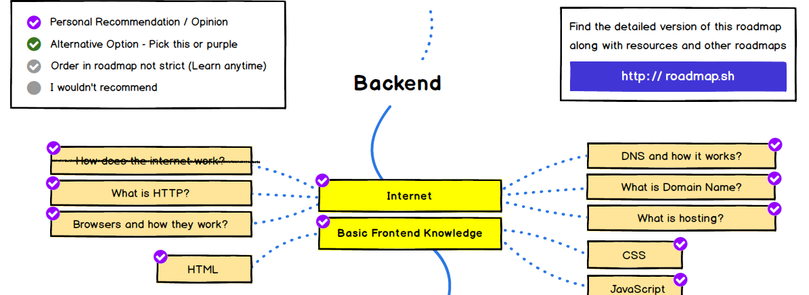
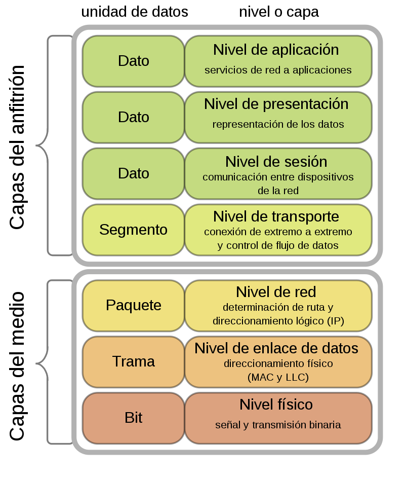
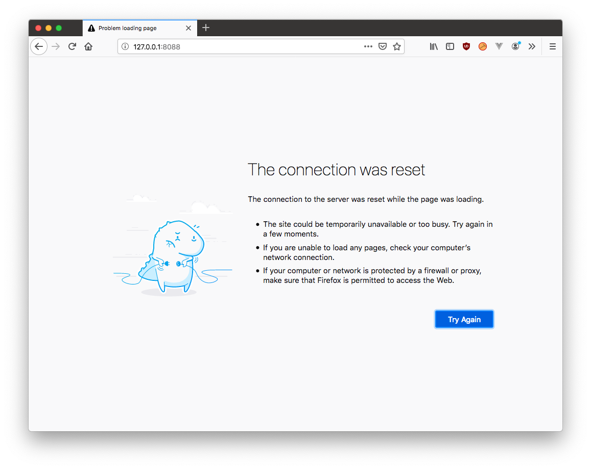
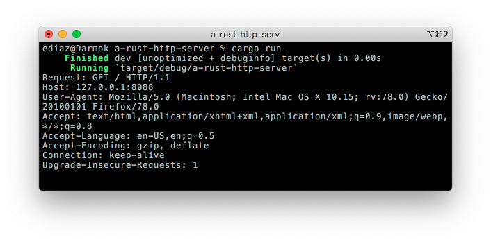
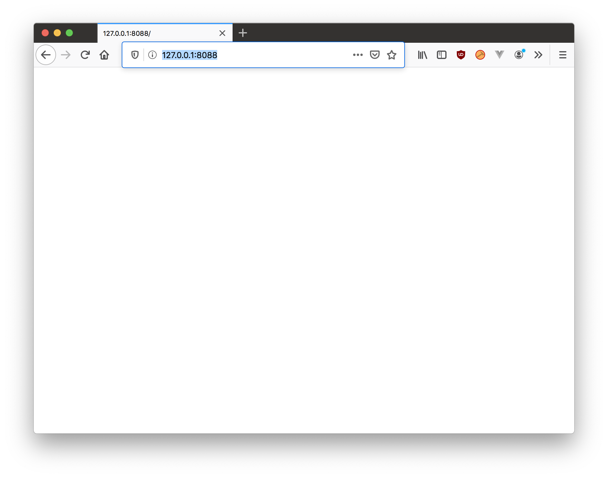
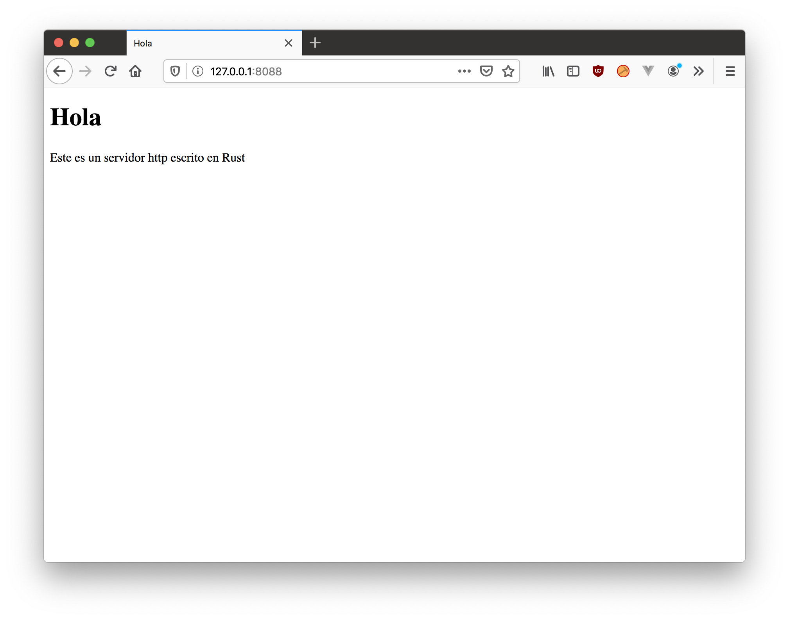
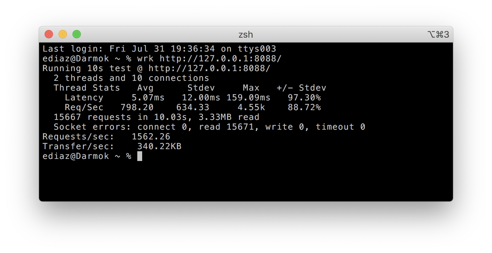

Seguimos con esta serie de artículos basado en el Backend Developer Roadmap publicado en el sitio [roadmap.sh](https://roadmap.sh/).

En el [artículo anterior](/blog/2020/07/05/el-camino-de-un-backend-developer-en-2020/) vimos los rudimentos de cómo funciona Internet. Escribimos un servidor y un cliente en python para un servicio muy sencillo.
Ahora, de acuerdo a nuestro mapa debemos entender qué es HTTP. 



Así que vamos a ese asunto. Pero antes, algo de teoría, porque siento que es necesario entender algunos conceptos básicos de protocolos antes de continuar.

## El Modelo ISO-OSI

En la década de 1980 la Unión Internacional de Telecomunicaciones (ITU) elaboró un modelo de referencia para protocolos de red, la que fue adoptado después por la Organización Internacional de Normalización (ISO) y que se conoce como el modelo OSI, por Open System Inteconnection.

Este modelo se creó con el fin de uniformar y ordenar el diseño de protocolos de red. En esa época habia una proliferación de estándares lo que generaba problemas de gestión, duplicida y entendimiento importantes. Pero además en esa época había una gran demanda por la interconexión entre distintas redes, y se hacia necesario unifromar conceptos.

Fue así como en 1980 se estableció un modelo de capas que sirvió de base para el desarrollo de las redes a partir de esa época.

El modelo define siete capas, tres a nivel del medio y tres a nivel del host.

### Capa 1: Física

Esta es la capa más baja del modelo OSI. Acá se define la conexión y topología de toda red. Es donde se define el medio físico por donde viajará la comunicación (cables coaxiales, o fibras ópticccas, por ejemplo). En este nivel se definen las características materiales y eléctricas que se usarán para la transmisión de datos en medios físicos.


### Capa 2: Enlace de Datos

Acá se realiza el direccionamiento físico y el acceso al medio, se detectan errores y se distribuyen de forma ordenadas de las tramas de datos y se ejecuta el control de flujo. 

En este nvies donde se localizan el protocolo MAC (Medium Access Control), que define el direccionamiento de los distintos dispositivos usando un estándar que asigna un código único a cada Network Interface Controller (NIC). Esta es la famosa Dirección MAC que aparece en nuestros computadores o cualquier dispositivo que conectemos a la red.

### Capa 3: Red

Acá aparecen los protocolos de enrutamiento entre diversas redes. Esta capa permite que los datos lleguen desde el origen al destino, aún cuando ambos no estén conectados directamente. Los dispositivos que permiten resolver esto son los famosos enrutadores (routers). Los firewalls se instalan en esta capa, pues pueden descartar direcciones de ciertas máquinas o limitar el acceso. A este nivel pertenece el protocolo IP.

### Capa 4: Trasporte

Acá ocurre el transporte de los datos que se encuentran empaquetados. A este nivel nos abstraemos del tipo de red física usada. Las unidades usadas a este nivel son los datagramas que aparecen cuando se usa UDP, y los segmentos cuando se usa TCP. 

La diferencia está en la orientación a la conexión. En TCP los segmentos llegan en orden y se hace todo el esfuerzo porque estos no se pierdan, para esto se establece un control de flujo y detección y corrección de errores. En UDP, por otro lado, los datagramas se intercambian en la red sin que necesariamente se haya establecido una conexión, no hay confirmacion ni control de flujo, así que algunos paquetes pueden adelantarse o perderse. 

Cuando usamos Sockets operamos a este nivel.


### Capa 5: Sesión

Esta capa se encarga de mantern y controlar el enlace entre dos dispositivos de red que intercambian datos. Esta se encarga de reanudar la conexión si se interrumpe. 

A este nivel encontramos protocolos como SMPP, ADSP (AppleTalk), PAP, NetBIOS, RTCP,  RPC o H.245.

Hoy en día con las aplicaciones multimedias esta capa es esencial.

### Capa 6: Presentación

Acá nos preocupamos de la representación de la información, para que los distintos equipos, que pueden tener representanciones internas distintas de la información, reconozcan la data que reciben.

Esta es la primera capa que trabaja con el contenido de la información que se comunica. Acá se ve la sintáxis y la semántica de los datos transmitodos. Acá podemos cifrar y comprimir los datos. 

### Capa 7: Aplicación

Esta es la capa que permite que accedamos a las demás capas desde nuestras aplicaciones. Acá se definen los protocolos de alto nivel que permiten interoperar entre aplicaciones o las personas con aplicaciones distribuidas en la red.

A este nivel pertenece HTTP, FTP, DHCP, POP, SSH, DNS, XMPP, etc.

Es en esta capa donde se ejecutan nuestro servicios finalmente.

Este diagrama resume las 7 capas del modelo OSI:



Cuando un cliente establece una interacción con un servicio en un servidor nuestros datos pasan por cada una de estas capas, partiendo desde la capa de aplicación en el servidor hasta llegar al cable físico y después al llegar al host del servidor la data "asciende" por cada capa que se encarga de realizar los controles respectivos hasta que la data llega a la capa aplicativa del servicio.

## El protocolo HTTP

Ahora que sabemos que HTTP es un protocolo a nivel de la capa de aplicación, vamos a trabajar en construir un servidor que lo implemente.

Esta vez usaremos Rust. Mucho de lo que veremos hoy está explicado en el Libro de Rust, así que mucho del código está adaptado del capítulo 20 de ese texto[^1]. 

###  Creando nuestro proyecto

Usando `cargo` crearemos un proyecto nuevo:

    $ cargo new a-rust-http-server
      Created binary (application) `a-rust-http-server` package
    $ cd a-rust-http-server

Esto crea todo lo necesario para implementar este proyecto. Abrimos el archivo src/main que contiene lo siguiente:

```rust
fn main() {
    println!("Hello, world!");
}
```

Reemplazaremos el código de main por lo siguiente:


```rust
use std::{io, fs};
use std::io::{Read, Write};
use std::net::{TcpListener, TcpStream};

fn main() -> io::Result<()> {
    let listener = TcpListener::bind("127.0.0.1:8088")?;
    for stream in listener.incoming() {
        handle_connection(stream?)?;
    }
    Ok(())
}

fn handle_connection(mut stream: TcpStream) -> io::Result<()> {
    let mut buffer = [0; 1024];

    stream.read(&mut buffer)?;
    println!("Request: {}", String::from_utf8_lossy(&buffer[..]));
    Ok(())
}
```

Esto es esencialmente lo mismo que hacía nuestro primer servidor en Python que escribimos en el artículo anterior. Abrimos un listner (que es un socket), en este caso sobre la dirección de nuestro servidor local y el puerto 8088. Tal como establecimos antes, los sockets nos dan acceso a la capa 4 de transporte, y esta biblioteca estándar de Rust usa IP como medio de transporte de red (Capa 3). En cierta forma la capa 6 nos garantiza que buffer tiene un string que podemos leer y analizar para poder implementar nuestro protocolo.

Nota: Este programa usa la notación moderna de gestión de errores de Rust (de ahí tantos signos de interrogación a lo largo del código). No voy a entrar mucho en esos detalles porque lo veremos más adelante cuando hablemos de este lenguaje, pero a los curiosos les indico que esto se explica muy bien en el libro de Rust en el capítulo 9: https://doc.rust-lang.org/book/ch09-00-error-handling.html, en esencia estoy dejando que Rust maneje los errores por mi y ante cualquier fallo el programa se detendrá arrojando un mensaje en la consola.


### Invocando al servidor 

Para ejecutar nuestro servidor hacemos:

    $ cargo run


Para probar nuestro servidor no necesitamos escribir un cliente, porque el protocolo HTTP es usado por los navegadores de internet, así que abrimos un navegador (Chrome, Safaari o Firefox, por ejemplo) y abrimos la dirección: http://127.0.0.1:8088/. Al hacer esto con Mozilla Firefox aparece esto:




pero en la consola donde está corriendo nuestro servidor veremos algo más o menos así:




Como pueden ver el navegador nos ha enviado una gran cantidad de información. Esto es el protocolo HTTP.

HTTP es un protocolo en la capa 7 y está basado en texto y toma este formato:

    METODO URI-REQUEST HTTP-Version CRLF
    headers CRLF
    cuerpo-del-mensaje

La primera linea es el `request` que tiene información sobre qué es lo que está solicitando el cliente.
Esta linea empieza con el METODO que puede ser GET o POST (hay otros métodos pero nos centraremos en estos que son los más usados). En nuestro ejemplo vemos que el método usado es GET.

Después del método viene la URI (Uniform Resource  Identifier) que describe el recurso que el cliente está solicitando. Ya veremos más adelante en otro artículo todo esto de los URI. Por ahora sólo los veremos como un identificador que nos dice qué está solicitando el cliente. En nuestro caso el uri es /.

Por último viene la versión del protocolo que soporta el browser, en este caso 'HTTP/1.1'. La linea termina con dos caracteres invisibles CR (Carriage Return) y LF (Line Feed).


Después vienen una serie de encabezados (headers) que en caso de nuestro ejemplo son:

    Host: 127.0.0.1:8088
    User-Agent: Mozilla/5.0 (Macintosh; Intel Mac OS X 10.15; rv:78.0) Gecko/20100101 Firefox/78.0
    Accept: text/html,application/xhtml+xml,application/xml;q=0.9,image/webp,*/*;q=0.8
    Accept-Language: en-US,en;q=0.5
    Accept-Encoding: gzip, deflate
    Connection: keep-alive
    Upgrade-Insecure-Requests: 1

El primero 'Host' indica la dirección a la que accede el cliente.

'User-Agent' es un header usado para identificar a los clientes que se conectan al servidor HTTP, en este caso se identifica al navegador Mozilla Firefox, versión 78.0.

'Accept' es un header que indica que tipos de respuestas acepta el navegador. Después vienen otros headers que se los dejo como ejercicio para que investiguen para que se usan.

Este ejemplo no tiene cuerpo de mensaje (este normalmente aparece cuando se usa el método POST).

Ahora, tenemos que resolver el problema que muestra el navegador, porque después de recibir el request nuestro servidor no ha sido muy cortés y ha terminado cerrando la conexión.

## Respondiendo adecuadamente 

Hasta ahora sólo hemos usado las capas inferiores de OSI para implementar nuestro protocolo, y estas capas son invisibles para nosotros. Pero HTTP es un protocolo de capa 7 y lo que estamos haciendo con este ejercicio es implementar esa capa.

La respuesta en el protocolo HTTP  son lineas de texto con la siguiente forma:

    HTTP-Version Codigo-Status Razon CRLF
    headers CRLF
    cuerpo-del-mensaje

Vamos a modificar la función handle_connection del siguiente modo:


```rust
fn handle_connection(mut stream: TcpStream) -> io::Result<()> {
    let mut buffer = [0; 1024];

    stream.read(&mut buffer)?;

    let response = "HTTP/1.1 200 OK\r\n\r\n";

    stream.write(response.as_bytes())?;
    stream.flush()
}
```

Con esto hemos resuelto el problema y nuestro navegador muestra lo siguiente:




OK, pero un servidor HTTP normalmente[^2] se usa para desplegar páginas HTML, así que vamos a agregar esa posibilidad. 

Primero escribimos un archivo que llamaremos `hola.html`:

```html
<!DOCTYPE html>
<html lang="es">
  <head>
    <meta charset="utf-8">
    <title>Hola</title>
  </head>
  <body>
    <h1>Hola</h1>
    <p>Este es un servidor http escrito en Rust</p>
  </body>
</html>
```

Para desplegar este archivo  modificamos nuestra función `handle_connection()`:


```rust
fn handle_connection(mut stream: TcpStream) -> io::Result<()> {
    let mut buffer = [0; 1024];

    stream.read(&mut buffer)?;

    let content = fs::read_to_string("hola.html")?;
    let response = "HTTP/1.1 200 OK\r\n\r\n";
    let response = format!(
        "HTTP/1.1 200 OK\r\nContent-Length: {}\r\n\r\n{}",
        content.len(),
        content
    );

    stream.write(response.as_bytes())?;
    stream.flush()
}
```

En la variable `content` guardamos el contenido del archivo `hola.html` y luego preparamos la respuesta usando la macro `!format()`, donde podran ver que colocamos la respuesta, luego un header `Content-Length` que indica el tamaño del contenido del archivo html. Esto es parte de la definición del protocolo HTTP.
Finalmente se agrega el contenido del archivo. Fíjense que hay una linea en blanco entre el encabezado y el contenido.

Si cargamos la dirección de nuevo en nuestro navegador veremos esto:



Y con esto tenemos casi todo lo básico para armar un servidor web. Pero tenemos un problema, cualquier petición ("request") a nuestro servidor siempre responde con la página "hola". Vamos a mejorar esto, sí la url consultada es "/" mostraremos la página, de lo contrario reportaremos un error. Una forma estándar en HTTP es usar el código 404 que indica que se está requriendo un recurso no disponible.

Lo normal es que ante esta situación además de informar con el error 404 se despliega una página HTML con el mensaje, este lo dejaremos en el archivo  `404.html`:

```html
<!DOCTYPE html>
<html lang="es">
<head>
    <meta charset="utf-8">
    <title>Error</title>
</head>
<body>
<h1>Ups!</h1>
<p>Lo sentimos, no sabemos qué buscas.</p>
</body>
</html>
```

Y modificaremos nuestra función `handle_connection` de este modo:


```rust
fn handle_connection(mut stream: TcpStream) -> io::Result<()> {
    let mut buffer = [0; 1024];

    stream.read(&mut buffer)?;

    const GET: &[u8; 16] = b"GET / HTTP/1.1\r\n";
    let (status, filename) = if buffer.starts_with(GET) {
        ("HTTP/1.1 200 OK\r\n", "hola.html")
    } else {
        ("HTTP/1.1 404 NOT FOUND\r\n", "404.html")
    };

    let content = fs::read_to_string(filename)?;
    let response = format!(
        "{}Content-Length: {}\r\n\r\n{}",
        status,
        content.len(),
        content
    );
    stream.write(response.as_bytes())?;
    stream.flush()
}
```

Lo que hacemos es que si el "request" empieza con el contenido de la constante `GET` entonces mostraremos la página `hola.html`, de lo contrario enviaremos un error 404 y mostraremos la página de error  `404.html`.

Si navegamos a cualquier uri distinta a "/" entonces la respuesta será esta:


Y con esto tenemos un servidor web funcional. Pero apenas hemos dado los primeros pasos para implementar el protocolo HTTP, para cubrirlo por completo falta más funcionalidad, la descripción completa del protocol está especificada en el RFC-7540 acá: https://tools.ietf.org/html/rfc7540. 

Por fortuna los Frameworks Web (como Flask, o Rocket) se encargan de toda esa complejidad. Pero con paciencia puedes implementarlo tu mismo, como te mostré con este ejercicio.

## Desempeño

Y ¿qué tal el desempeño de este simple servidor?. Vamos a usar la herramienta [wrk](https://github.com/wg/wrk) para ver cuantos requerimientos por segundo es capaz de atender nuestro server:



Obtenemos 1562 requests por segundo, ¡nada mal!

Correr en modo "release" no mejora mucho más  el desempeño. 
¿Podemos mejorar el desempeño? Para responder eso tenemos que explorar otra competencia que veremos más adelante (threads y concurrencia).

### Código fuente

Tódo el código fuente de este ejercicio se encuentra en este repo GitHub: https://github.com/lnds/desafios-programando.org/tree/master/2020-07-31/a-rust-http-server.

Está basado en el capítulo 20 de El Libro sobre Rust: https://doc.rust-lang.org/book/ch20-01-single-threaded.html.

### Ejercicio

1. Implementa este servicio en tu lenguaje de programación favorito.
2. Modifica este servicio para que pueda responder con distintas páginas que se encuenten en el directorio donde se ejecuta.


[^1]: Ver https://doc.rust-lang.org/book/ch20-01-single-threaded.html.
[^2]: Digo normalmente, porque se puede usar para implementar APIs REST entre otras cosas, como veremos más adelante en esta serie.
