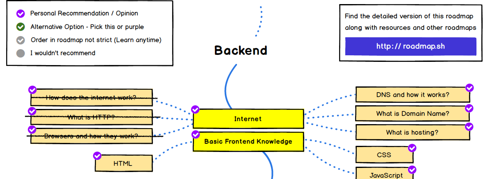
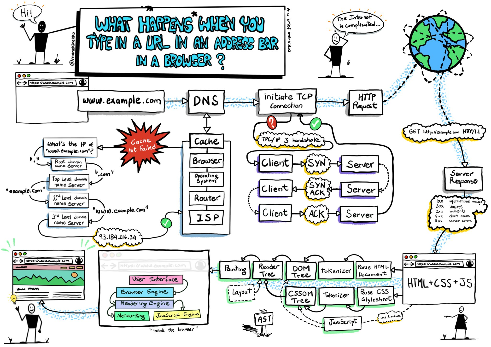
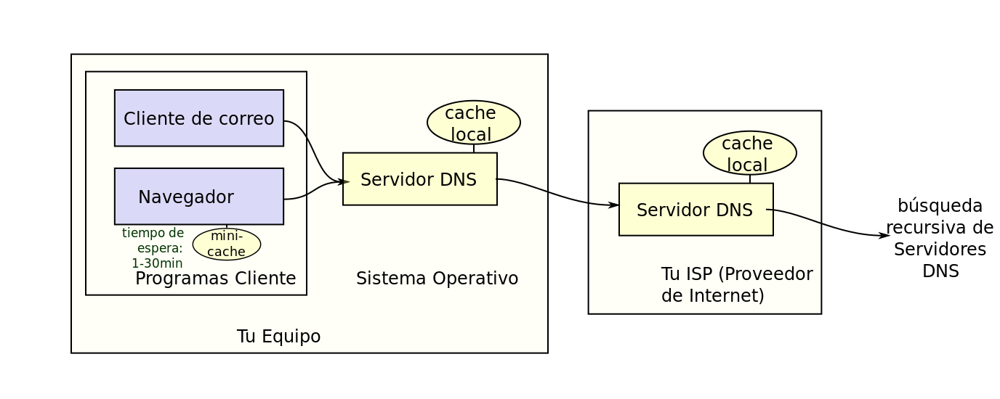

Continuemos nuestro camino por la ruta del [backend developer](/categories/backend-developer/), donde estamos siguiendo la recomendación del sitio [roadmap.sh](https://roadmap.sh/), sobre las competencias básicas que debería tener un desarrollador backend en 2020.

Como pueden ver hemos cubierto los primeros tres hitos de la izquierda, y hoy en este post empezaremos a conocer de que trata todo eso de los nombres de dominio, que significa hosting y como funciona DNS.

Así que en esta ocasión vamos a introducir algunos conceptos fundamentales para entender DNS, pero antes de continuar les recuerdo que  estos artículos pueden ser apoyados a través de [Kofi](https://ko-fi.com/lnds), si te interesa lo que estoy escribiendo, puedes invitarme a un café, o cerveza, virtual a través de este link: https://ko-fi.com/lnds. 

Además he establecido una meta en este sitio para poder publicar esta serie de artículos como libro, así que si quieres apoyar ese proyecto haz click acá:



## ¿Qué pasa cuando escribes una dirección en tu navegador?

En el artículo anterior vimos cómo un navegador funciona, pero eso describe una parte de la historia. 
Recientemente se viralizó en twitter este dibujo de [Wassim Chegham](https://t.co/Lcmfa8mi1i?amp=1) ([@manekinekko](https://twitter.com/manekinekko/))
 

En este dibujo se puede apreciar gran parte de lo que ocurre cuando digitas una url en tu navegador.

Hasta ahora en todos los artículos previos he usado el término [URL](https://es.wikipedia.org/wiki/Localizador_de_recursos_uniforme) sin definirlo, pero todos ustedes tienen una intuición de qué significa, es eso que escriben en el navegador que empieza normalmente con las letras http. Pero la definición formal de URL es más amplia, y vamos a detenernos un momento a revisarla.

URL viene de Uniform Resource Locator (localizador de recursos uniforme),y fueron introducidos por [Tim Berners-Lee](https://es.wikipedia.org/wiki/Tim_Berners-Lee) cuando diseño la Web. Fueron formalizados en el documento [RFC-1738](https://tools.ietf.org/html/rfc1738) de 1994[^0].  

Las URL son un tipo especial de URI (Uniform Resource Identifier), que es simplemente una cadena de caracteres que permite identificar de manera única un recurso. Para garantizar la uniformidad todas las URIs siguen una determinada sintáxis.

Un tipo de URI son los URNs (Uniform Resource Name) que se usa para identificar recursos por un nombre en un espacio de nombres particulares. 

Por ejemplo, la primera edición de mi libro ["La Naturaleza del Software"](https://www.amazon.com/-/es/Naturaleza-del-Software-Spanish-ebook/dp/B00GF0FV1C/ref=cm_cr_arp_d_product_top?ie=UTF8) tiene el ISBN (International Standar Book Number) 978-956-353-640-9, que es un número de serie universal que se da a cada edición de libros en el planeta. Para expresarlo en notación URN usaríamos esta sintáxis: 

        urn:isbn:978-956-353-640-9

La forma general de una URI es:

        URI = scheme:[//authority]path[?query][#fragment]

o usando un [diagrama sintátcico](https://es.wikipedia.org/wiki/Diagrama_sintáctico):

El `scheme` es usado en las URL para identificar el [protocolo de aplicación](/blog/2020/07/31/el-camino-del-backend-developer-http/) usado para obtener el recurso, de este modo cuando escribimos `https` estamos indicando que es un recurso que se encuentra disponible en un host que soporta el protocolo http sobre un canal seguro.

Así que una URL es una URI usada en el contexto de la web, nos permite encontrar recursos que están disponibles en algún servidor (o host).

Y acá aprovechamos de aclarar el concepto de hosting. Se trata simplemente de un servicio, provisto por alguna compañía, que permite alojar los servidores donde dejaremos nuestros recursos.

Por ejemplo, este blog está alojado en [Netlify](https://www.netlify.com/), que es una plataforma de servicios en la nube que permite alojar, entre otras cosas, páginas HTML estáticas, como las que genero para escribir estos artículos.

Hay una diversidad de servicios de hosting, "compartidos", "dedicados", "virtuales dedicados", "administrados", etc. 
El tema es extenso y es importante conocerlo, pero de poca relevancia para esta serie de artículos, así que les voy a dejar este link en wikipedia para que se informen sobre todo los aspectos asociados al hosting: https://en.wikipedia.org/wiki/Web_hosting_service

Pero, en resumen, lo que nos interesa es que todo recurso en la web reside en un host (provisto por un servicio de hosting), y para poder identificar esos recursos usamos las URLs.

Cómo hemos visto[^1] en un host se aloja uno o varios servicios de internet, este host o servidor tiene al menos una dirección IP. Entonces lo que hace un browser es primero identificar la dirección del host, para esto extrae ese valor de la URL y consulta al DNS (Sistema de Nombres de Dominio) por ese nombre de host para obtener la IP.

Por ejemplo, este artículo está alojado en la siguiente URL: https://www.programando.org/blog/2020/09/05/el-camino-del-backend-developer-dns/, el host es, en este caso: [`www.programando.org`](https://www.programando.org/).

El navegador debe resolver la dirección IP del host, para esto primero accede a su caché interna (que es un almacenamiento temporal de hosts con sus direcciones), si no encuentra la dirección IP en su tabla interna, entonces consulta al sistema operativo, que también tiene una tabla caché con con nombres de hosts y sus direcciones IP. Si no encuentra allí, solicita la dirección al Router que te conecta a internet (que también tiene una caché de hosts), luego a tu proveedor de internet (ISP) y así recursivamente. Pero el detalle de como termina resolviéndose las direcciones lo veremos más adelante.

## Nombres de Dominio

Hemos visto que las URL tienen un host, pero este host se designa de una manera extraña:

        www.programando.org

Un nombre de dominio es simplemente un string (o cadena de caracteres) que define un entorno de administración autónmo dentro de la red. Yo soy dueño del entorno asociado a programado.org, eso quiere decir, que puedo crear recursos y servicios que puedo disponibilizar bajo el dominio `programando.org`. En particular `www` es un subdominio dentro del dominio `programando.org`. Pero `programando.org` está dentro de una unidad organizativa más amplia que es `.org`.

Los dominios se organizan de forma jerárquica. Todo esto se define en el [Sistema de Nombres de Dominios o DNS (Domain Name System)](https://es.wikipedia.org/wiki/Sistema_de_nombres_de_dominio).

El DNS define una nomenclatura jerárquica para administrar los nombres de los dominios dentro de la red.
Este sistema nació de la necesidad de organizar y recordar fácilmente los nombres de todos los servidores disponibles en internet.

En el nombre de dominio `www.programando.org` tenemos las siguientes componentes (las que están separadas por un punto):

- `org`: es el TLD (Top Level Domain), o dominio de nivel superior
- `programando`: es un subdominio
- `www`: es un subdominio de tercer nivel.

En teoría se pueden tener 127 sub niveles que se van colocando a la izquierda del TLD. Cada etiqueta que identifica estos niveles tiene hasta 63 caracteres. Con todo, un nombre de dominio no puede exceder los 255 caracteres.

Estas restricciones son relevantes para poder implementar el protocolo DNS de forma eficiente.

Veamos este diagrama que sale en Wikipedia[^2]:

Tal como explicamos recién, la resolución de la dirección IP de un host, a través de su nombre dominio, requiere que accedamos a una serie de elementos externos a nuestro navegador, que se encuentran en el sistema operativo y en otras entidades externas (desde el router, hasta el ISP). Cada paso hacia estas entidades externas se realiza usando un protocolo conocido como el protocolo DNS.

El navegador y tu sistema operativo implementan clientes de este protocolo que se usa para acceder a los servidores DNS externos.

Un cliente DNS disponible en nuestro sistema operativo es la herramienta `dig`[^3].

Esta es una herramienta de gestión de redes que nos permite realizar peticiones DNS a distintos servidores.

La forma general de uso de este comando es:

        dig @IP dominio tipo

- `@IP` indica la IP de un servidor DNS al que le haremos una consulta.

- `dominio` es el dominio que queremos consultar

- `tipo` es el tipo de consulta que haremos.

Si omites @IP se usarán los servidores DNS disponibles por defecto en tu sistema operativo[^4].

Veamos que pasa si hago una consulta por el dominio de este sitio:

        $ dig www.programando.org

La respuesta que se obtiene es la siguiente:

        ; <<>> DiG 9.10.6 <<>> www.programando.org
        ;; global options: +cmd
        ;; Got answer:
        ;; ->>HEADER<<- opcode: QUERY, status: NOERROR, id: 6237
        ;; flags: qr rd ra; QUERY: 1, ANSWER: 1, AUTHORITY: 0, ADDITIONAL: 1

        ;; OPT PSEUDOSECTION:
        ; EDNS: version: 0, flags:; udp: 4096
        ;; QUESTION SECTION:
        ;www.programando.org.		IN	A

        ;; ANSWER SECTION:
        www.programando.org.	20	IN	A	18.230.52.212

        ;; Query time: 72 msec
        ;; SERVER: 200.75.0.5#53(200.75.0.5)
        ;; WHEN: Sat Sep 05 12:55:22 -04 2020
        ;; MSG SIZE  rcvd: 64

Esto lo que nos dice es que el servidor web de este blog está, en este momento, alojado en el servidor con la IP 18.230.52.212. Entonces cuando escribes `www.programando.org` en tu browser serás dirigido a un host alojado en esa IP.

¿Quiere decir esto que si escribo https://18.230.52.212/ en mi browser, veré este blog?

La respuesta es no. Si intentas hacerlo tendrás una serie de advertencias de tu navegador sobre seguridad y terminarás encontrando una página que dice "not found" o algo similar.

La razón es que mi hosting es compartido, hay muchos sitios alojados en ese host, y para diferenciar el servidor se apoya del nombre del sitio que es enviado al hacer el request HTTP. Como vimos en [este artículo anterior](/blog/2020/07/31/el-camino-del-backend-developer-http/), el navegador se asegura de enviar en los encabezados HTTP el nombre del dominio al que quiere acceder, esto permite al servidor web identificar cuál es el recurso que debe despachar. Al colocar simplemente la IP el navegador no envía suficiente información para que el servidor web pueda identificar cuál de todos los recursos compartidos es el que debe enviar.

¿Qué más nos informa el comando dig? ¿Qué significan todo esos códigos y seccioones que aparecen?

Para responder eso debemos adentrarnos en el protocolo DNS y un forma de hacerlo es construyendo nuestro propio servidor DNS, algo que abordaremos en el siguiente post de esta serie.

[^0]: Los [RFC](https://www.ietf.org/standards/rfcs/) (Requests for Comments) son los documentos oficiales usados por la [Internet Engineering Task Force](https://www.ietf.org/), que es la organización que resguarda los estándares que definen la operación de internet. 
[^1]: Lo explicamos en el [primer artículo de esta serie](/blog/2020/07/05/el-camino-de-un-backend-developer-en-2020/).
[^2]: Sistema de Nombres de Dominio en Wikipedia: https://es.wikipedia.org/wiki/Sistema_de_nombres_de_dominio
[^3]: En Linux y MacOS está disponiible, en Windows probablemente tendrás que instalarla.
[^4]: Típicamente los que están configurados en tu sistema operativo en el archivo `/etc/resolv.conf` en mi caso el sistema operativo configura las IP de los servidores DNS provistos por mi ISP y la IP de mi router.